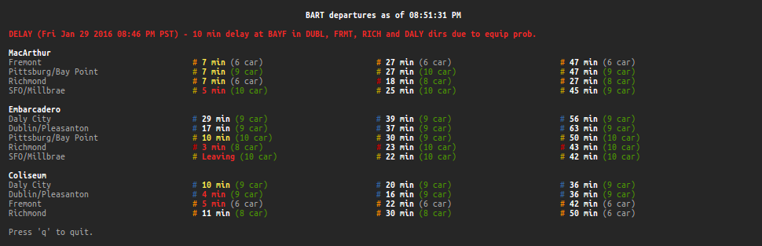

# pybart
Real time BART (Bay Area Rapid Transit) information in your terminal!

## Features
- Real time estimates and service advisories
- curses based TUI with auto-refreshing
- View multiple stations at the same time
- Ability to configure a default set of stations

## Requirements
- Python 2.6+ or Python 3.0+ with the `curses` module installed (i.e. not
  Windows)
- Terminal with 256 color support to correctly display the Richmond-Fremont
  line as orange (magenta otherwise)
  - Note: this usually involves setting the `TERM` environment variable to
    `xterm-256color`

## Installation
`pip install pybart`

## Usage
    Usage: bart [OPTION]... [STN]...
    Display real time estimates about the STNs
    (using the BART_STATIONS environment variable if not specified).

    Options
      -l, --list     print list of station abbreviations and exit
      -h, --help     display this help and exit
      -v, --version  output version information and exit

    Examples
      bart mcar       get estimates for the MacArthur station
      bart embr cols  get estimates for the Embarcadero and Coliseum stations

## Configuration
The following (optional) environment variables can be used to configure pybart:

- `BART_STATIONS` - a comma-separated string (e.g. `mcar,embr,cols`)
  specifying the default stations to use when running `bart` with no arguments
- `BART_API_KEY` - the BART API key to use when fetching information. A public
  one is used by default, but you can get your own
  [here](http://api.bart.gov/api/register.aspx).

## License
[BSD 3-Clause](https://opensource.org/licenses/BSD-3-Clause)
